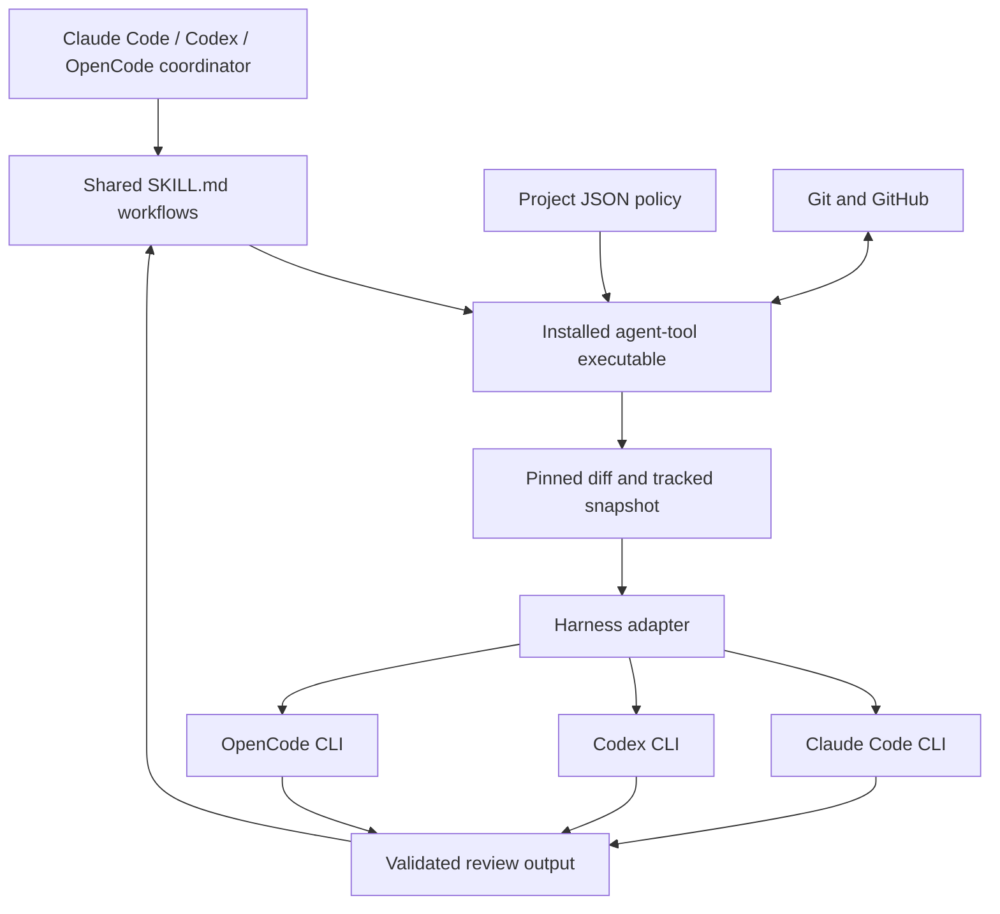

# Design and implementation choice

The extraction separates executable behavior, data-only repository policy,
portable workflows, and harness integration. These boundaries are more useful
than choosing a language before finding the shared behavior.

`src/harnesses.ts` defines a small integration boundary: executable, skill
discovery path, default effort, prompt access note, and a review invocation.
Git snapshots and review output validation are shared. Tool permissions, config
isolation, argument construction, and final-message extraction remain adapter
concerns because the CLIs have different semantics. Adding a harness should not
require copying Git or PR code.

`agent-tool.json` controls policy without running repository code. This
deliberately covers a subset of arbitrary commitlint configurations; complex
project-specific validation remains in project hooks/checks. `AGENT_TOOL_CONFIG`
can pin a policy file outside a feature checkout. The schema is versioned and
validated, so settings have an explicit contract.

`skills/` contains portable workflow instructions. The build generates one
embedded bundle; installation copies it into harness discovery directories.
The manifest distinguishes tool-managed files from local edits. It does not
rewrite AGENTS.md, CLAUDE.md, opencode.json, auth files, or hooks. The library is
project-scoped today. A future global installer needs explicit discovery scope
and separate ownership tracking, rather than treating the home directory as a
project.

The CLI performs single operations. Skills own repair loops and the
commit/review/push/open/check/merge/cleanup sequence. This lets whichever harness
coordinates the task use its own planning and editing capabilities without
building three competing orchestration engines. It also keeps review-only
requests from implicitly shipping changes.

## TypeScript versus Rust

| Choice | Benefits | Costs |
| --- | --- | --- |
| TypeScript compiled with Bun | Retains tested code; one executable; quick extraction; familiar contributors | Bundled runtime size; Bun used for builds; some version discovery uses Bun.Glob |
| Rust rewrite | Smaller potential runtime footprint; typed process/resource supervision; native release ecosystem | Reimplement Git tree validation and CLI behavior; parity testing; compile/dependency maintenance |
| TypeScript CLI with a Rust helper | Keep workflow compatibility while adding strong process/sandbox supervision | Two components and release/version coordination |

The first release stays in TypeScript. The produced binary runs without Node or
Bun on PATH, so packaging and language choice are independent. Bun documents
standalone builds and macOS/Linux cross-compilation in its
[executable guide](https://bun.sh/docs/bundler/executables).

Rust becomes compelling if executable size, memory, process-tree cancellation,
or platform sandbox supervision becomes a measured constraint. Preserve the
CLI/JSON contracts and behavioral fixture tests, then replace one module at a
time. A future Rust binary can embed the same skill sources using build-time
generation; the skills do not need a language rewrite.

## Distribution

Local tooling builds four architecture/OS archives with checksums and generates
a Homebrew formula pointing at a chosen repository's release assets. A Debian
builder creates amd64 or arm64 packages from the Linux binaries. Reviewers and
their authentication remain separate installations.

A tap and release assets provide the initial Brew route. Downloadable Debian
packages provide the initial apt route. Named apt installation additionally
requires signed repository metadata, hosting, and repository-source setup. No
public distribution infrastructure is created as part of this extraction.

## Follow-up boundaries

The next useful work is migrating one representative project and comparing
review/ship behavior against its existing skill flow. Configure its CI/title
policy first, preserve local skill additions, then replace repository-local
launcher references with the installed binary. Expand to other projects once
that migration passes.

Stronger process isolation should be a separate, tested platform layer. The
macOS-only credential-free preflight in `stealth` is useful evidence, but not yet
a Linux-compatible runtime contract. Likewise, merge protection policy, fork PR
creation, custom skill packs, and global skill scope need deliberate APIs rather
than hidden repository assumptions.
